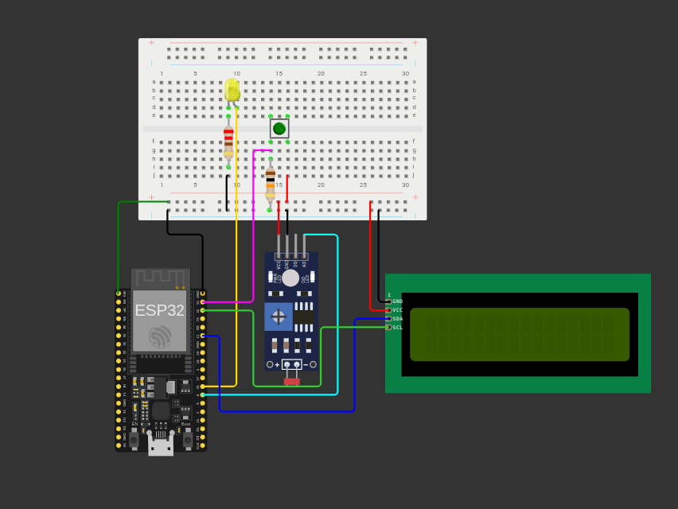

# esp32-monitoring-control 🖧
Este repositório tem o objetivo de descrever todo o processo de resolução da atividade teórica/prática I da matéria de IoT.

## Resolução da Atividade Teórica 📜
**Questão 1:** 
> a) Qual o valor inteiro máximo retornado por analogRead() em cada uma dessas placas?

O valor inteiro máximo retornado por analogRead() na Esp32 é de 4095, pois a resolução do ADC é de 12 bits, o que significa que ele pode representar valores de 0 a 4095 (2^12 - 1). Já no Arduino Uno, o valor inteiro máximo retornado por analogRead() é de 1023, pois a resolução do ADC é de 10 bits, permitindo representar valores de 0 a 1023 (2^10 - 1).

>b) Por que é necessário utilizar a função map() ou um cálculo de proporção
antes de enviar o valor de um sensor analógico para uma saída PWM
(analogWrite)?

A função map() ou um cálculo de proporção é necessário para converter o valor do sensor analógico, que pode variar em uma faixa específica (por exemplo, 0 a 4095 para a Esp32), para a faixa de valores que a saída PWM (analogWrite) pode aceitar (geralmente 0 a 255). Isso é importante porque o valor do sensor analógico pode ser muito grande para ser diretamente usado na saída PWM, e a função map() ajuda a escalar esse valor para que ele se encaixe corretamente na faixa de saída desejada.

**Questão 2:**
> Explique por que o protocolo I2C é vantajoso em projetos com
múltiplos periféricos (como displays e sensores) utilizando apenas dois pinos do
microcontrolador (SDA e SCL).

O protocolo I2C é vantajoso em projetos com múltiplos periféricos porque permite a comunicação entre o microcontrolador e vários dispositivos usando apenas dois pinos: SDA (Serial Data Line) e SCL (Serial Clock Line). Isso simplifica o design do circuito, reduz a quantidade de fios necessários e facilita a conexão de múltiplos sensores e displays sem a necessidade de pinos adicionais para cada dispositivo. Além disso, o I2C suporta endereçamento, permitindo que cada dispositivo tenha um endereço único, o que facilita a comunicação e o controle de vários periféricos em um sistema.

## Resolução da Atividade Prática 🕹️

A atividade prática consistiu em criar um sistema de monitoramento e controle utilizando a placa Esp32. O sistema foi projetado para ler dados de um sensor LDR (Sensor de Luminosidade), processar esses dados e controlar um lED através da saída PWM com base na leitura do sensor.

#### Ferramentas Utilizadas:

#### Componentes Utilizados:
- Placa Esp32
- Sensor LDR (Sensor de Luminosidade)
- LED
- Resistores
- Protoboard
- Cabos de conexão
- LCD I2C 
- Botão de controle

#### Circuito:
O circuito foi montado da seguinte forma:

#### Autor: 
Vicente Junior